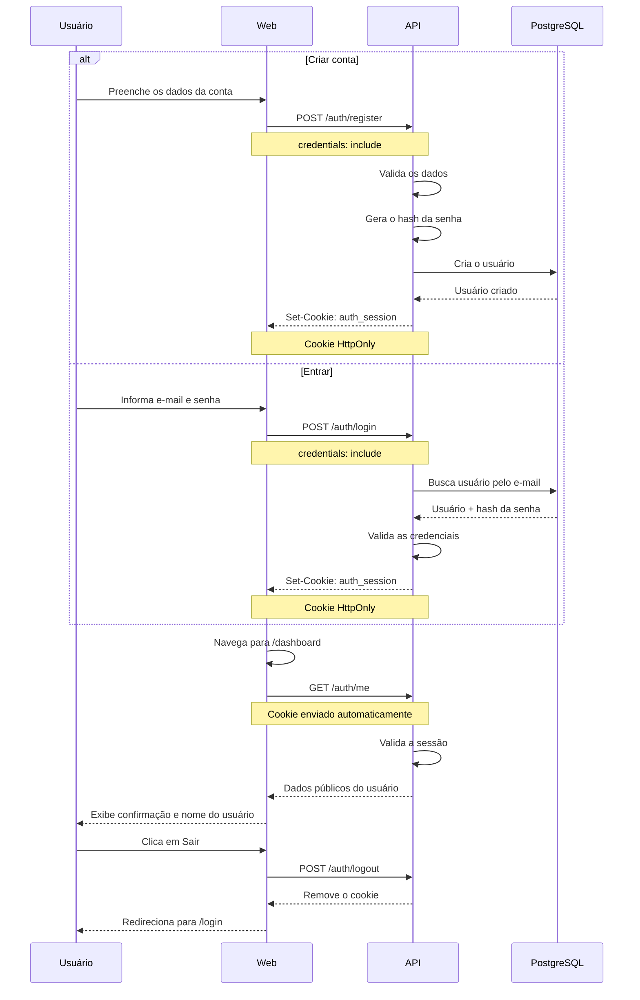

# AuthLab

Experimento de autenticação com criação de conta, login e uma tela de confirmação, usando cookie HttpOnly para manter a sessão sem expor o token ao JavaScript do navegador.

**Demo:** _em breve_ · **Documentação da API:** `/docs` · **Post no Lab:** _em breve_

## Contexto

Aplicações com frontend e API separados precisam manter a identidade do usuário entre requisições.

O AuthLab isola esse fluxo em um monorepo pequeno, composto apenas por `web` e `api`, para demonstrar de forma direta o ciclo de autenticação:

- criação de conta;
- login com e-mail e senha;
- criação da sessão;
- persistência da autenticação através de cookie HttpOnly;
- consulta do usuário autenticado;
- proteção da área autenticada;
- encerramento da sessão.

O foco do experimento é o uso de **cookie HttpOnly** como transporte da sessão.

A interface recebe os dados necessários através da API, mas não lê nem armazena o token de autenticação em `localStorage` ou `sessionStorage`.

Existem três páginas:

```text
/login
/create-account
/dashboard
```

A tela de criação de conta permite cadastrar um novo usuário.

Após a autenticação, o `/dashboard` funciona como uma tela de confirmação do experimento, exibindo os dados necessários do usuário e o estado da sessão.

## Decisões técnicas

**Cookie HttpOnly como transporte da sessão.**

A API define o cookie através do header `Set-Cookie` e o navegador o envia automaticamente nas requisições seguintes.

O frontend não precisa ter acesso ao token e não recebe o valor da sessão no JSON retornado pelo login ou pela criação da conta.

---

**Sessão validada pela API.**

O estado do frontend não determina se o usuário está autenticado.

Ao acessar uma área protegida, o frontend consulta a API através de `/auth/me`. Somente uma sessão válida permite que os dados do usuário sejam retornados.

---

**Criação de conta integrada ao fluxo de autenticação.**

A criação de conta acontece através da API.

Depois de validar os dados e persistir o usuário, a API pode iniciar a sessão no mesmo fluxo, permitindo que o usuário siga diretamente para o dashboard sem precisar realizar um novo login.

---

**Frontend e API independentes.**

O frontend é uma aplicação React utilizando TanStack Router em modo `router-only`.

A API é construída separadamente com Express e concentra autenticação, validação de credenciais, cookies e acesso ao banco de dados.

---

**CORS com origem explícita e credenciais.**

Como frontend e API são aplicações separadas, as requisições de autenticação utilizam:

```ts
credentials: 'include'
```

A API permite credenciais apenas para a origem configurada do frontend.

---

**Cookie configurado conforme o ambiente.**

O cookie de autenticação utiliza:

- `HttpOnly`;
- `Path=/`;
- tempo de expiração definido;
- `Secure` em produção;
- `SameSite=Lax` quando frontend e API pertencem ao mesmo site.

A configuração deve acompanhar a arquitetura de domínio utilizada no deploy.

---

**Senha armazenada como hash.**

Senhas nunca são armazenadas em texto puro.

A API compara a senha enviada no login com o hash armazenado no banco de dados.

Nenhuma resposta de autenticação expõe:

- senha;
- hash;
- token de sessão.

## Stack

| Tecnologia           | Uso                                            |
| -------------------- | ---------------------------------------------- | --- |
| React + TypeScript   | Interface                                      |
| TanStack Router      | Roteamento do frontend                         |
| Vite                 | Ambiente e build da aplicação web              |
| Express + TypeScript | API de autenticação                            |
| Prisma               | ORM e acesso aos dados                         |
| PostgreSQL           | Persistência dos usuários                      |
| Zod                  | Validação das entradas                         |
| cookie-parser        | Leitura dos cookies recebidos pela API         |
| CORS                 | Comunicação entre frontend e API               |     |
| pnpm workspaces      | Organização do monorepo                        |
| Turborepo            | Execução e organização das tarefas do monorepo |     |

## Fluxo de autenticação



---

Construído por [Arthur Reis](https://buildwitharthur.com.br) como parte do [ArthurLabs Lab](https://arthurlabs.io).
