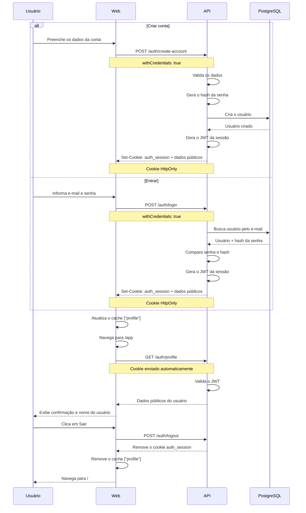

# AuthLab

Experimento de autenticação com criação de conta, login e uma tela de confirmação, usando cookie HttpOnly para manter a sessão sem expor o token ao JavaScript do navegador.

**Demo:** _em breve_ · **Post no Lab:** _em breve_

## Contexto

Aplicações com frontend e API separados precisam manter a identidade do usuário entre requisições.

O AuthLab isola esse fluxo em um monorepo pequeno, composto apenas por `web` e `api`, para demonstrar de forma direta o ciclo de autenticação:

- criação de conta;
- login com e-mail e senha;
- criação de sessão através de JWT;
- persistência através de cookie HttpOnly;
- consulta do profile autenticado;
- proteção das rotas privadas;
- redirecionamento das páginas públicas quando já autenticado;
- logout e limpeza do estado de sessão no frontend.

O foco do experimento é o uso de **cookie HttpOnly** como transporte da sessão.

A interface recebe os dados necessários através da API, mas não lê nem armazena o token de autenticação em `localStorage` ou `sessionStorage`.

Existem três rotas no frontend:

```text
/
/create-account
/app
```

`/` é a tela de login. `/create-account` permite cadastrar um novo usuário. Ambas ficam sob um layout público que consulta a sessão atual e redireciona para `/app` caso o usuário já esteja autenticado.

`/app` é a área protegida e a tela final do experimento: um `AuthGuard` consulta o profile autenticado e redireciona para `/` quando não há sessão válida. Quando há sessão, a página exibe o primeiro nome do usuário, informa que a sessão está ativa e orienta a pessoa a abrir DevTools → Application → Cookies para conferir o `auth_session` marcado como HttpOnly — inclusive `document.cookie` não expõe esse valor, já que o cookie não é acessível via JavaScript.

Durante a verificação assíncrona da sessão, o frontend usa Suspense com skeletons equivalentes ao layout final, evitando tela vazia e mudança brusca de altura.

## Stack

### Web

| Tecnologia          | Uso                                     |
| -------------------- | ---------------------------------------- |
| React + TypeScript   | Interface                                |
| TanStack Router      | Roteamento                                |
| TanStack Query       | Estado assíncrono e cache do profile     |
| React Hook Form      | Controle dos formulários                 |
| Zod                  | Validação dos formulários e entradas     |
| Axios                | Cliente HTTP                             |
| Tailwind CSS         | Estilização                              |
| Vite                 | Desenvolvimento e build                  |

### API

| Tecnologia            | Uso                                          |
| ---------------------- | --------------------------------------------- |
| Express + TypeScript   | API                                            |
| Prisma                 | ORM e acesso aos dados                        |
| PostgreSQL             | Persistência                                  |
| bcryptjs               | Hash de senha                                 |
| jsonwebtoken           | Geração e validação da sessão                 |
| cookie-parser          | Leitura dos cookies                           |
| CORS                   | Comunicação web/API                           |
| express-rate-limit     | Proteção básica das rotas de autenticação     |

O monorepo é organizado com **pnpm workspaces**, contendo apenas `apps/web` e `apps/api`.

## Fluxo de autenticação



---

Construído por [Arthur Reis](https://buildwitharthur.com.br) como parte do [ArthurLabs Lab](https://arthurlabs.io).
